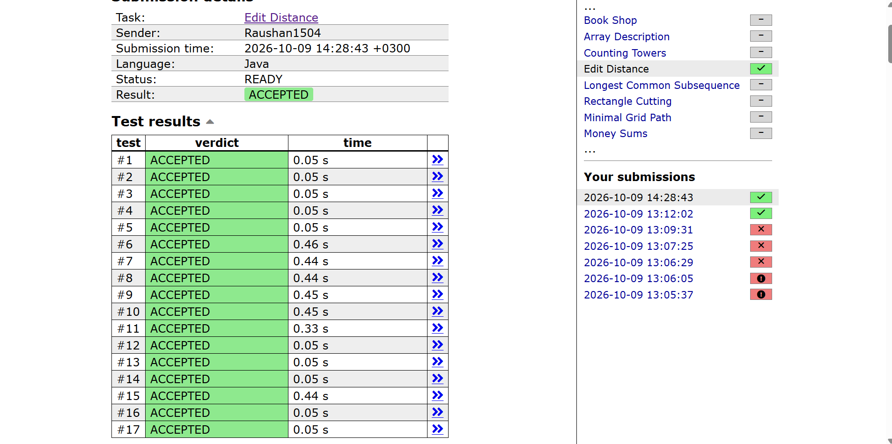

# Edit Distance (Dynamic Programming)

## Problem

Given two strings `s1` and `s2`, find the **minimum number of operations** needed to turn `s1` into `s2`. Each operation can be one of:

- **Insert** a character
- **Delete** a character
- **Replace** a character with another one

**Input**
```
s1
s2
```

**Output**
A single integer: the minimum number of operations.

**Example**

```
LOVE
MOVIE
```
Output: `2`

One optimal sequence: `LOVE -> MOVE` (replace `L` with `M`), then `MOVE -> MOVIE` (insert `I`).

---

## Key Idea

This is a classic **2D dynamic programming** problem (the Levenshtein distance).

Define:

```
dp[i][j] = minimum operations to turn the first i characters of s1
           into the first j characters of s2
```

The answer is `dp[n][m]`, where `n = s1.length()` and `m = s2.length()`.

We build the answer from smaller prefixes. To compute `dp[i][j]`, look at the last characters `s1[i-1]` and `s2[j-1]`:

**Case 1: the characters are equal.** No operation is needed for them, so we inherit the cost of the shorter prefixes:

```
dp[i][j] = dp[i-1][j-1]
```

**Case 2: the characters differ.** We must spend one operation, and we pick the cheapest of three choices:

| Operation | Meaning | Previous state |
|-----------|---------|----------------|
| Delete | Delete `s1[i-1]`, then match the first `i-1` chars of `s1` with the first `j` chars of `s2` | `dp[i-1][j]` |
| Insert | Insert `s2[j-1]` at the end of `s1`, so the first `i` chars of `s1` only need to match the first `j-1` chars of `s2` | `dp[i][j-1]` |
| Replace | Replace `s1[i-1]` with `s2[j-1]`, then match the first `i-1` and `j-1` chars | `dp[i-1][j-1]` |

```
dp[i][j] = 1 + min(dp[i-1][j], dp[i][j-1], dp[i-1][j-1])
```

### Base cases

- `dp[i][0] = i`: turning the first `i` characters of `s1` into an empty string takes `i` deletions.
- `dp[0][j] = j`: turning an empty string into the first `j` characters of `s2` takes `j` insertions.

---

## How the Code Works

1. Create a table `arr` of size `(n + 1) x (m + 1)`.
2. Fill the first column with `0, 1, 2, ..., n` and the first row with `0, 1, 2, ..., m` (the base cases).
3. Fill the rest of the table row by row. Each cell only depends on cells above it, to its left and diagonally up-left, which are already computed by the time we reach it.
4. Return `arr[n][m]`.

The `+ 1` in the table size is what makes room for the "empty prefix" row and column.

---

## Walkthrough

For `s1 = "LOVE"`, `s2 = "MOVIE"`, the filled table is:

```
         ""   M   O   V   I   E
   ""     0   1   2   3   4   5
   L      1   1   2   3   4   5
   O      2   2   1   2   3   4
   V      3   3   2   1   2   3
   E      4   4   3   2   2   2
```

A few cells worked out:

- `dp[2][2]` (`O` vs `O`): characters match, so it equals `dp[1][1] = 1`.
- `dp[3][3]` (`V` vs `V`): characters match, so it equals `dp[2][2] = 1`.
- `dp[3][4]` (`V` vs `I`): they differ, so it is `1 + min(dp[2][4]=3, dp[3][3]=1, dp[2][3]=2) = 2`.
- `dp[4][5]` (`E` vs `E`): characters match, so it equals `dp[3][4] = 2`.

The bottom-right cell is the answer: **2**.

---

## Submission Result

The solution was accepted on all test cases.



---

## Complexity

Let `n = |s1|` and `m = |s2|`.

### Time: O(n · m)

- The table has `(n + 1) * (m + 1)` cells.
- Each cell is computed in constant time: one character comparison and at most two `Math.min` calls.
- The base cases take O(n + m), which is negligible next to the main loops.

For strings of length up to 5000, that is about `25 * 10^6` cell computations, which runs comfortably within the time limit.

### Space: O(n · m)

- The full 2D table is stored, so it uses `(n + 1) * (m + 1)` entries.
- Since each entry is a `long` (8 bytes), two strings of length 5000 need about 200 MB.

---

## Possible Optimizations

- **Use `int` instead of `long`.** The edit distance can never exceed `max(n, m)`, so `int` is always enough. This halves the memory.
- **Use two rolling rows.** Each row only depends on the previous row, so keeping just two rows reduces the space to **O(min(n, m))** with the same O(n · m) time. The trade-off is that you can no longer reconstruct the actual sequence of operations from the table.
