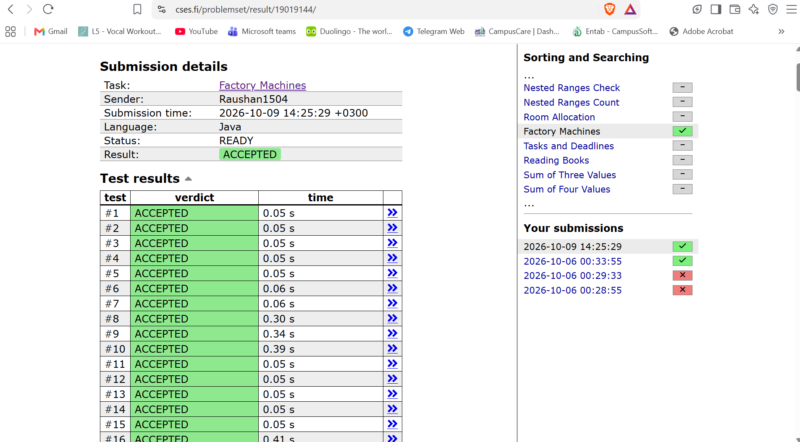

# Factory Machines (Binary Search on the Answer)

## Problem

A factory has `n` machines. Machine `i` takes `k_i` seconds to make one product, and all machines work **in parallel** and continuously. Find the **minimum time** needed to make at least `t` products in total.

**Input**
```
n t
k1 k2 ... kn
```

**Output**
A single integer: the minimum number of seconds needed to make at least `t` products.

**Example**

```
3 7
3 2 5
```
Output: `8`

After 8 seconds the machines have made `8/3 + 8/2 + 8/5 = 2 + 4 + 1 = 7` products. After 7 seconds they have only made `2 + 3 + 1 = 6`, which is not enough.

---

## Key Idea

Instead of trying to compute the answer directly, we ask a yes/no question:

> **"Can the machines make at least `t` products within `T` seconds?"**

In `T` seconds, machine `i` makes `floor(T / k_i)` products, so the total is:

```
total(T) = floor(T / k_1) + floor(T / k_2) + ... + floor(T / k_n)
```

This function is **monotonic**: giving the machines more time can never produce fewer products. So the answers to our question look like this as `T` grows:

```
T:       1   2   3  ...  7    8    9   ...
Enough?  No  No  No ...  No   Yes  Yes ...
```

There is a single point where "No" flips to "Yes", and we want that first "Yes". Whenever answers flip exactly once like this, we can find the flip point with **binary search on the answer**.

---

## How the Code Works

### `isPossible(machines, time, target)`

Adds up `time / machineTime` for every machine and returns `true` as soon as the running total reaches `target`.

The early return (`if (TotalProducts >= target) return true;`) has two benefits:

- It saves work, since we can stop scanning machines once we have enough.
- It **prevents overflow**: the running total is always below `target` (at most about `10^9`) before each addition, and each term is at most about `10^18`, so the sum never exceeds the range of `long`.

### `search(machines, low, high, target)`

A standard binary search for the **smallest** `time` where `isPossible` is `true`:

- `mid = low + (high - low) / 2` (written this way to avoid overflow).
- If `mid` works, the answer is `mid` or something smaller, so set `high = mid` (keep `mid` as a candidate).
- If `mid` does not work, the answer must be larger, so set `low = mid + 1`.
- When `low == high`, the range has shrunk to a single value, which is the minimum valid time.

### Search range

- `low = 1`: at least one second is needed since `t >= 1`.
- `high = maxTime * target`: the slowest machine, working alone, makes `t` products in `maxTime * t` seconds. The real answer can't be worse than that, because the other machines only help.

---

## Walkthrough

For `machines = [3, 2, 5]`, `target = 7`: `low = 1`, `high = 5 * 7 = 35`.

| low | high | mid | products at `mid` | enough? | action |
|-----|------|-----|-------------------|---------|--------|
| 1 | 35 | 18 | 6 + 9 + 3 = 18 | yes | `high = 18` |
| 1 | 18 | 9 | 3 + 4 + 1 = 8 | yes | `high = 9` |
| 1 | 9 | 5 | 1 + 2 + 1 = 4 | no | `low = 6` |
| 6 | 9 | 7 | 2 + 3 + 1 = 6 | no | `low = 8` |
| 8 | 9 | 8 | 2 + 4 + 1 = 7 | yes | `high = 8` |

Now `low == high == 8`, so the answer is **8**.

---

## Submission Result

The solution was accepted on all test cases.



---

## Complexity

Let `n` be the number of machines, `t` the target number of products and `K` the largest machine time.

### Time: O(n log(K · t))

- The search range goes from `1` to `K * t`, which is at most about `10^18`.
- Each iteration halves the range, so binary search makes about `log2(K * t)` iterations, which is roughly **60** at most.
- Each iteration calls `isPossible`, which loops over up to `n` machines in O(n).
- Total: O(n) work per iteration times O(log(K · t)) iterations. With `n` up to `2 * 10^5`, that is about `1.2 * 10^7` operations, which is very fast.

Reading the input and finding the maximum are each O(n), which is negligible next to the search.

### Space: O(n)

- Only the `machines` array is stored.
- The binary search itself uses O(1) extra variables (`low`, `high`, `mid`).

---

## Why Not Simulate Time Directly?

Simulating second by second would take up to `10^18` steps, far too slow. Binary search reduces that to about 60 checks, because we only need to know whether a given time is enough, not what happens at every second in between.

---

## Notes

- `long` is used throughout because `maxTime * target` can reach about `10^18`, which overflows `int`.
- The initial value `Integer.MIN_VALUE` for `maxTime` is fine, since every machine time is positive and replaces it immediately.