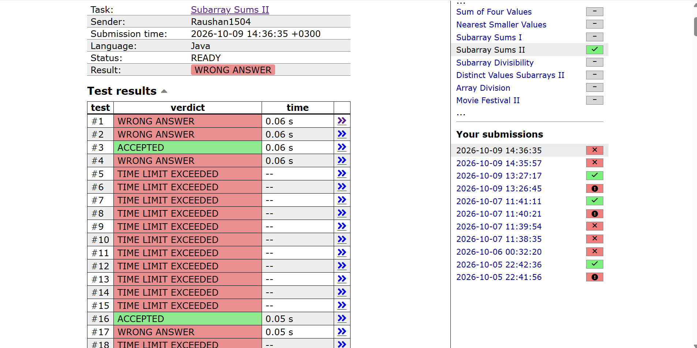

# Count Subarrays With a Given Sum (Brute Force, O(n³))

## Problem

Given an array of `n` integers and a target sum `x`, count the contiguous subarrays whose elements add up to exactly `x`.

**Example**

```
5 7
2 4 1 2 7
```
Output: `3`  (`[2, 4, 1]`, `[4, 1, 2]` and `[7]`)

---

## Approach

Check **every** subarray directly:

1. Pick a start index `i`.
2. Pick an end index `j >= i`.
3. Add up `arr[i..j]` with a third loop `k`.
4. If the sum equals `x`, increase the count.

```java
for (int i = 0; i < n; i++) {
    for (int j = i; j < n; j++) {
        long sum = 0;
        for (int k = i; k <= j; k++) {
            sum += arr[k];
        }
        if (sum == target) count++;
    }
}
```


---

## Complexity

### Time: O(n³)

- Two nested loops choose the subarray: about `n² / 2` pairs `(i, j)`.
- For each pair, a third loop re-adds all the elements from `i` to `j`, which costs up to `n` operations.
- Together this is roughly `n³ / 6` operations, which is O(n³).

### Space: O(1) extra

- Only a few variables (`i`, `j`, `k`, `sum`, `count`) are used, apart from the input array.

---

## Why This Is Not Good

- With `n` up to `2 * 10^5`, `n³` is about `8 * 10^15` operations. A typical judge handles around `10^8` per second, so this would take months.
- It is **wasteful**: for each `(i, j)` the sum is recomputed from scratch, even though the sum for `(i, j)` is just the sum for `(i, j - 1)` plus `arr[j]`.
- It is only fine for tiny inputs (roughly `n <= 200`).

---

## Better Solutions

| Approach | Time | Space | Idea |
|----------|------|-------|------|
| Brute force (this one) | O(n³) | O(1) | Re-add every subarray |
| Running sum per start | O(n²) | O(1) | Keep `sum` while extending `j`, drop the `k` loop |
| Sliding window | O(n) | O(1) | Two pointers (positive numbers only) |
| Prefix sum + HashMap | O(n) | O(n) | Count earlier prefixes equal to `curr_sum - x` |

---

## Submission Result

Expected to exceed the time limit on large test cases.

