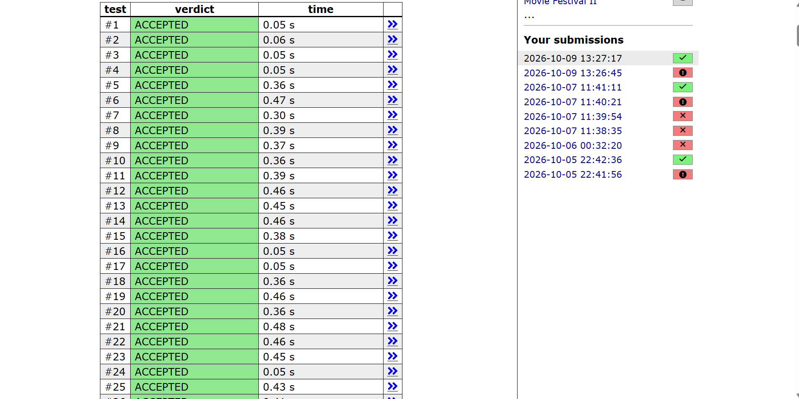

# Why Prefix Sum + HashMap Is the Best Approach

## Problem

Count the contiguous subarrays of an integer array (negatives and zeros allowed) whose sum equals a target `x`.

---

## The Idea in One Line

The sum of a subarray is the difference of two prefix sums:

```
sum(j+1..i) = P[i] - P[j]
```

So a subarray ending at `i` has sum `x` exactly when an earlier prefix sum equals `P[i] - x`. A `HashMap` that counts how many times each prefix sum has appeared lets us look that up in O(1).

```java
total += p_count.getOrDefault(curr_sum - target, 0L);
p_count.put(curr_sum, p_count.getOrDefault(curr_sum, 0L) + 1);
```

---

## Comparison of All Approaches

| Approach | Time | Extra space | Negatives / zeros | Verdict |
|----------|------|-------------|-------------------|---------|
| Brute force (3 loops) | O(n³) | O(1) | Works | Far too slow |
| Running sum per start (2 loops) | O(n²) | O(1) | Works | Too slow for large `n` |
| Sliding window | O(n) | O(1) | **Fails** | Only for positive numbers |
| **Prefix sum + HashMap** | **O(n)** | O(n) | **Works** | **Fast and always correct** |

---

## Why It Wins

1. **Fast.** It makes one pass over the array with O(1) average work per element, so O(n) in total. For `n = 2 * 10^5` that is only a few hundred thousand operations.
2. **Always correct.** It never assumes the sum grows or shrinks in a predictable way, so it works for positive numbers, negatives and zeros.
3. **Counts every subarray.** Because the map stores *how many times* each prefix sum occurred, it counts all valid starting points, including the ones that zeros and negatives create.


---


---

## Related Files

- `README_prefix_sum.md`: full explanation and walkthrough
- `README_sliding_window_fails.md`: why the sliding window breaks
- `README_brute_force.md`: why the O(n³) approach is too slow