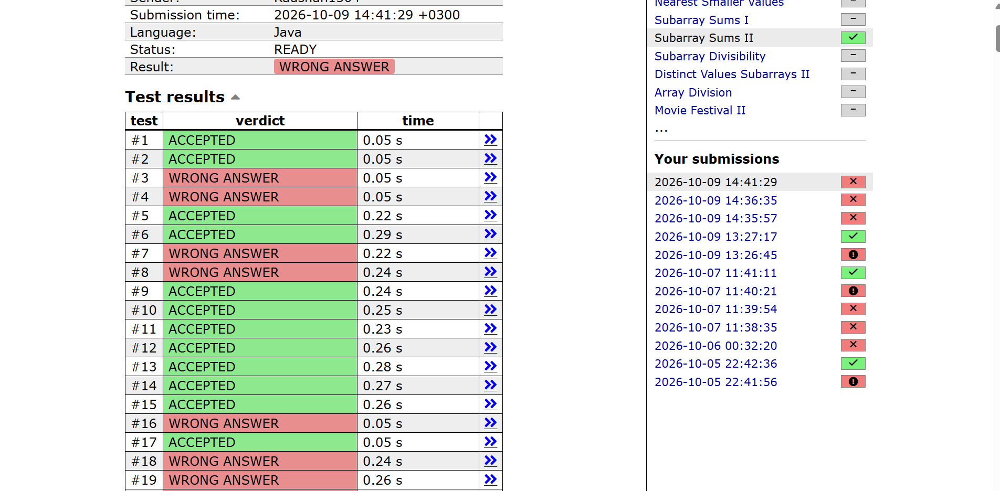

# Count Subarrays With a Given Sum (Sliding Window: Why It Fails)

## Problem

Given an array of `n` integers (which **may be negative or zero**) and a target sum `x`, count the contiguous subarrays whose elements add up to exactly `x`.

---

## Approach

Use two pointers, `left` and `right`, and a running `sum` of the window:

1. Add `arr[right]` to `sum`.
2. While `sum > target`, subtract `arr[left]` and move `left` forward.
3. If `sum == target`, increase the count.

```java
for (int right = 0; right < n; right++) {
    sum += arr[right];
    while (sum > target) {
        sum -= arr[left];
        left++;
    }
    if (sum == target) count++;
}
```

---

## Complexity

- **Time: O(n).** `left` and `right` each move forward at most `n` times.
- **Space: O(1) extra**, apart from the input array.

It is fast, but speed does not help if the answer is wrong.

---

## Why It Fails

The shrinking step assumes that **if the window sum is too big, removing elements from the left is the only way to fix it**, and that a larger sum never becomes useful again. That is only true when all numbers are positive.

### Problem 1: Negative numbers

Dropping elements permanently throws away starting points that could still work later, because a negative number can bring the sum back down.

```
arr = [4, -1], x = 3
```

- `right = 0`: `sum = 4`, which is more than `3`, so `4` is removed and `left` moves on. `sum = 0`.
- `right = 1`: `sum = -1`, not equal to `3`.
- The code outputs **0**, but the correct answer is **1** (`[4, -1]` sums to `3`).

The `4` was discarded too early, even though the negative number that follows it fixes the sum.

### Problem 2: Zeros

When zeros are present, several different starting points can give the same sum for one end index, but the code only counts one per `right`.

```
arr = [0, 3], x = 3
```

- Both `[3]` and `[0, 3]` sum to `3`, so the correct answer is **2**.
- The code finds the window `[0, 3]` at `right = 1` and counts it once, so it outputs **1**.

---

## The Fix: Prefix Sum + HashMap

Instead of moving a window, use prefix sums. The sum of the subarray ending at `i` and starting after position `j` is `P[i] - P[j]`. So for every `i`, count how many earlier prefix sums equal `P[i] - x`, using a `HashMap` that stores how many times each prefix sum has appeared.

This never needs the sum to grow or shrink in a predictable way, so it works for **any** integers, including negatives and zeros, and still runs in O(n) time (with O(n) space).

See `README_prefix_sum.md` for the full explanation.

---

## Summary

| | Sliding Window | Prefix Sum + HashMap |
|---|---|---|
| Time | O(n) | O(n) |
| Extra space | O(1) | O(n) |
| Positive numbers only | **Yes** | No |
| Handles negatives and zeros | **No** | **Yes** |

---

## Submission Result
